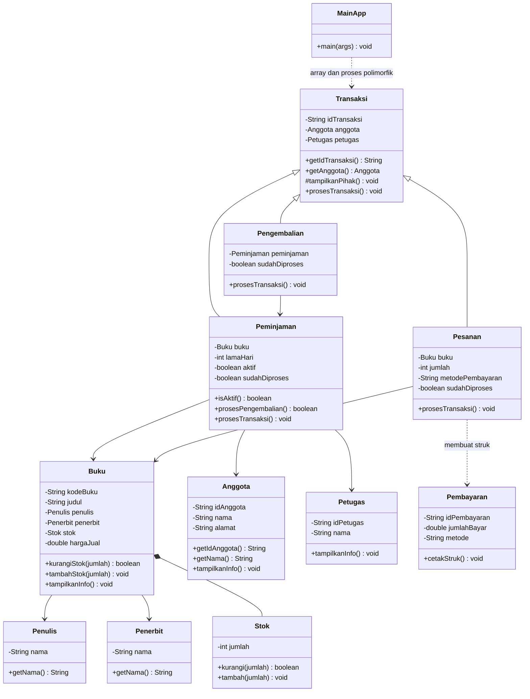

# UML Class — BadWolf Store

```mermaid
classDiagram
    class Buku {
        -String kodeBuku
        -String judul
        -Penulis penulis
        -Penerbit penerbit
        -Stok stok
        -double hargaJual
        +kurangiStok(jumlah) boolean
        +tambahStok(jumlah) void
        +tampilkanInfo() void
    }
    class Anggota {
        -String idAnggota
        -String nama
        -String alamat
        +getIdAnggota() String
        +getNama() String
        +tampilkanInfo() void
    }
    class Petugas {
        -String idPetugas
        -String nama
        +tampilkanInfo() void
    }
    class Penulis {
        -String nama
        +getNama() String
    }
    class Penerbit {
        -String nama
        +getNama() String
    }
    class Stok {
        -int jumlah
        +kurangi(jumlah) boolean
        +tambah(jumlah) void
    }
    class Pembayaran {
        -String idPembayaran
        -double jumlahBayar
        -String metode
        +cetakStruk() void
    }
    class Transaksi {
        -String idTransaksi
        -Anggota anggota
        -Petugas petugas
        +getIdTransaksi() String
        +getAnggota() Anggota
        #tampilkanPihak() void
        +prosesTransaksi() void
    }
    class Peminjaman {
        -Buku buku
        -int lamaHari
        -boolean aktif
        -boolean sudahDiproses
        +isAktif() boolean
        +prosesPengembalian() boolean
        +prosesTransaksi() void
    }
    class Pengembalian {
        -Peminjaman peminjaman
        -boolean sudahDiproses
        +prosesTransaksi() void
    }
    class Pesanan {
        -Buku buku
        -int jumlah
        -String metodePembayaran
        -boolean sudahDiproses
        +prosesTransaksi() void
    }
    class MainApp {
        +main(args) void
    }

    Transaksi <|-- Peminjaman
    Transaksi <|-- Pengembalian
    Transaksi <|-- Pesanan
    Buku --> Penulis
    Buku --> Penerbit
    Buku *-- Stok
    Peminjaman --> Buku
    Peminjaman --> Anggota
    Peminjaman --> Petugas
    Pengembalian --> Peminjaman
    Pesanan --> Buku
    Pesanan ..> Pembayaran : membuat struk
    MainApp ..> Transaksi : array dan proses polimorfik
```
